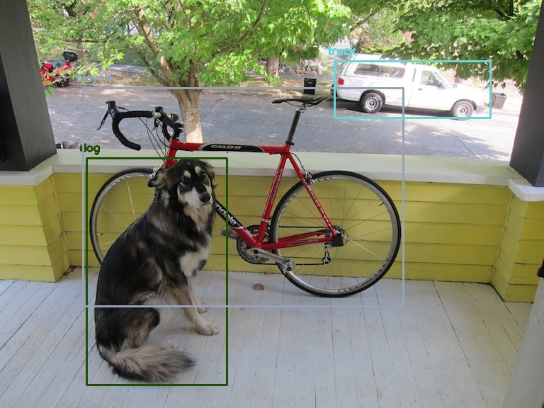

# Object Detection using Deep Learning with OpenCV and Python

OpenCV's `dnn` module supports running inference on pre-trained deep learning models from popular frameworks such as Caffe, Torch, and TensorFlow. This repository demonstrates how to perform object detection using popular frameworks like YOLO, SSD, and Faster R-CNN.

## Table of Contents

- [Introduction](#introduction)
- [Dependencies](#dependencies)
- [YOLO (You Only Look Once)](#yolo-you-only-look-once)
  - [Download Weights](#download-weights)
  - [Running YOLO with OpenCV](#running-yolo-with-opencv)
  - [Sample Output](#sample-output)
- [Further Resources](#further-resources)
- [Contributing](#contributing)
- [License](#license)

## Introduction

This project provides examples of how to use the OpenCV `dnn` module to perform object detection using pre-trained models. Currently, it includes an implementation for YOLO (You Only Look Once). Examples for SSD and Faster R-CNN will be added soon.

## Dependencies

- OpenCV
- NumPy

Install the dependencies using pip:

```bash
pip install numpy opencv-python
```

**Note:** Compatibility with Python 2.x is not officially tested.

## YOLO (You Only Look Once)

YOLO is a state-of-the-art, real-time object detection system. This section explains how to set up and run YOLO v3 using OpenCV.

### Download Weights

Download the pre-trained YOLO v3 weights file from this [link](https://pjreddie.com/media/files/yolov3.weights) and place it in the current directory. You can also download it directly to the current directory using the following command:

```bash
wget https://pjreddie.com/media/files/yolov3.weights
```

### Running YOLO with OpenCV

Provided all the necessary files are in the current directory, you can apply object detection on the input image `dog.jpg` using the following command:

```bash
python yolo_opencv.py --image dog.jpg --config yolov3.cfg --weights yolov3.weights --classes yolov3.txt
```

**Command format**:

```bash
python yolo_opencv.py --image /path/to/input/image --config /path/to/config/file --weights /path/to/weights/file --classes /path/to/classes/file
```

### Sample Output



## Further Resources

For a detailed explanation of the implementation, check out this [blog post](http://www.arunponnusamy.com/yolo-object-detection-opencv-python.html).

You can also explore [cvlib](http://cvlib.net), which provides a simplified API for detecting common objects using the function `detect_common_objects()`.

## Contributing

Contributions are welcome! If you would like to contribute, please fork the repository and create a pull request with your changes. 

1. Fork the Project
2. Create your Feature Branch (`git checkout -b feature/AmazingFeature`)
3. Commit your Changes (`git commit -m 'Add some AmazingFeature'`)
4. Push to the Branch (`git push origin feature/AmazingFeature`)
5. Open a Pull Request

## License

This project is licensed under the MIT License. See the `LICENSE` file for more details.

---

Thank you for your interest in this project! If you have any questions or feedback, please open an issue or contact the repository maintainer.
